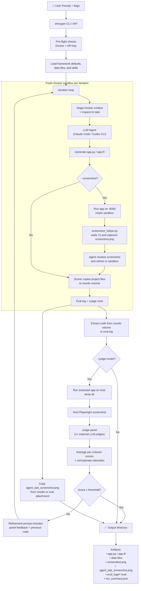

# shinygen

Generate, evaluate, and refine Shiny apps using LLM agents (Claude Code, Codex CLI) in Docker sandboxes.

## Architecture

For full documentation — installation, CLI, Python API, batch mode, GitHub Actions, model aliases, skills, and data inputs — see the published docs:

**[https://karangattu.github.io/shinygen/](https://karangattu.github.io/shinygen/)**
