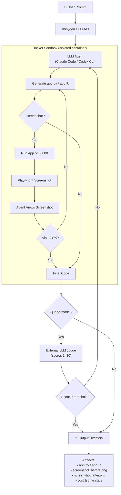

# shinygen

Generate, evaluate, and refine Shiny apps using LLM agents (Claude Code, Codex CLI) in Docker sandboxes.

## Architecture



### How It Works

1. **You run a command** — provide a prompt, pick a model, and (optionally) enable `--screenshot` and `--judge-model`.
2. **A Docker sandbox spins up** — an isolated container with Shiny, Playwright, and Chromium pre-installed.
3. **The LLM agent generates the app** inside the sandbox, writing `app.py` (Python) or `app.R` (R).
4. **Visual self-evaluation** (when `--screenshot` is enabled) — the agent starts the app inside the container, takes a Playwright screenshot, reviews the visual output, and fixes any layout/styling issues. This loop runs entirely inside the sandbox.
5. **External quality judge** (when `--judge-model` is set) — a separate LLM evaluates the code and optional screenshots, scoring on functionality, design, code quality, and UX. If the score is below the threshold, the agent refines and tries again.
6. **Final output** — the app, screenshots, and stats are copied to your output directory.

### What You Get

```
my-dashboard/
├── app.py                  # The generated Shiny app
├── screenshot_before.png   # Initial render (if --screenshot)
├── screenshot_after.png    # After interaction (if --screenshot)
└── data.csv                # Your data file (if provided)
```

The CLI also prints a summary:

```
Score: 8.25 / 10.00 (after 2 iterations)
Time:  45.2s total (38.1s generate, 7.1s judge)
Tokens: 12,340 input / 3,210 output
Cost:  $0.1842
```

## Installation

```bash
# from a local checkout of this repo
cd /path/to/shinygen
python3 -m venv .venv
source .venv/bin/activate
python -m pip install --upgrade pip
python -m pip install -e ".[dev]"
```

If you only need the runtime dependencies, use `python -m pip install -e .` instead of the editable dev install above.

## Quick Start

### CLI

```bash
# Generate a Shiny for Python app with Claude Sonnet
shinygen generate \
    --prompt "Create a sales dashboard with filters by region and product category" \
    --model claude-sonnet \
    --output ./my-dashboard

# With screenshot-based quality evaluation and iteration
shinygen generate \
    --prompt "Create a clinical trials dashboard" \
    --model claude-opus \
    --output ./trials-app \
    --screenshot \
    --judge-model claude-sonnet \
    --max-iterations 5

# Shiny for R
shinygen generate \
    --prompt "Create an interactive data explorer" \
    --model claude-sonnet \
    --framework shiny-r \
    --output ./r-app

# With custom skills and data files
shinygen generate \
    --prompt "Build a dashboard for this dataset" \
    --model gpt54 \
    --output ./my-app \
    --skills-dir ./my-skills/ \
    --csv-file ./sales.csv
```

`web_fetch` is enabled by default. Use `--no-web-fetch` to disable web search.

### Python API

```python
import shinygen

result = shinygen.generate(
    prompt="Create a sales dashboard with regional filters",
    model="claude-sonnet",
    output_dir="./my-dashboard",
    framework="shiny-python",
    data_csv="./sales.csv",
    screenshot=True,
    judge_model="claude-sonnet",
    max_iterations=5,
)

print(result.app_dir)       # ./my-dashboard
print(result.score)          # 4.5
print(result.iterations)    # 2
```

### Batch over a CSV

If you want one generated app per row in a dataset, loop over the CSV and call the Python API for each record. The example below uses the checked-in `trials_short_50.csv`, enables screenshot mode, and writes each run to its own output directory.

```python
from csv import DictReader
from pathlib import Path
import re

import shinygen


def slugify(value: str) -> str:
    value = re.sub(r"[^a-zA-Z0-9]+", "-", value).strip("-").lower()
    return value or "row"


csv_path = Path("test_data_csv_files/trials_short_50.csv")
output_root = Path("batch_outputs")
output_root.mkdir(parents=True, exist_ok=True)

with csv_path.open(newline="", encoding="utf-8") as handle:
    for row in DictReader(handle):
        prompt = (
            "Create a Shiny dashboard for this clinical trial record.\n"
            f"Title: {row['Title']}\n"
            f"Acronym: {row['Acronym']}\n"
            f"Conditions: {row['Conditions']}\n"
            f"Interventions: {row['Interventions']}\n"
            f"Outcome Measures: {row['Outcome Measures']}\n"
            f"Study Type: {row['Study Type']}\n"
        )

        output_dir = output_root / f"{row['Rank']}_{slugify(row['NCT Number'])}"

        shinygen.generate(
            prompt=prompt,
            model="claude-sonnet",
            framework="shiny_python",
            output_dir=output_dir,
            data_csv=csv_path,
            screenshot=True,
            judge_model="claude-sonnet",
            max_iterations=3,
        )
```

If you want to parallelize the dataset later, keep the same prompt pattern and split the CSV into chunks first; each chunk can still pass `screenshot=True`.

## Run from GitHub Actions

Use the manual workflow at `.github/workflows/run-shinygen.yml` to run one `shinygen generate` job from the Actions UI and download the generated outputs as an artifact.

1. Add repository secrets:
   - `ANTHROPIC_API_KEY`
   - `OPENAI_API_KEY`
2. In GitHub, open **Actions** → **Run shinygen** → **Run workflow**.
3. Fill the typed inputs (`prompt`, `model`, `framework`, screenshot/judge options, and iteration settings), then start the run.
4. After completion, open the run summary and download artifact `shinygen-run-<run_id>`.

The artifact contains the full run output directory (`gha_runs/run-<run_id>`), including the generated app file (`app.py` or `app.R`), screenshots when enabled, `eval_logs/`, raw CLI output in `run.log`, and extracted timing/cost/token summary in `run_metrics.txt`.

### Parallel Multi-Model Runs (up to 8 runners)

Use `.github/workflows/run-shinygen-multi.yml` when you want to evaluate the **same prompt** across multiple models in parallel.

1. Open **Actions** → **Run shinygen (multi-model parallel)** → **Run workflow**.
2. Set `models` as a comma-separated or newline-separated list (max 8), for example:
   - `claude-opus, claude-sonnet, gpt54, gpt54-mini, codex-gpt53`
3. Keep the same shared settings (`prompt`, `framework`, screenshot/judge options, thresholds).
4. Start the run. GitHub fans out one matrix job per model with `max-parallel: 8`.
5. Download either:
   - per-model artifacts (`shinygen-run-<run_id>-<idx>-<model-slug>`), or
   - a combined aggregate artifact (`shinygen-run-<run_id>-aggregate`).

Each per-model artifact includes generated app outputs, `eval_logs/`, `run.log`, and `run_metrics.txt` for timing/cost/tokens. The aggregate artifact contains all per-model artifact directories plus an `INDEX.txt`.

## Features

- **Multiple LLM agents**: Claude Code (Anthropic) and Codex CLI (OpenAI)
- **Docker sandboxes**: Isolated generation via Inspect AI
- **R and Python**: Generate Shiny for Python (`app.py`) or Shiny for R (`app.R`)
- **Visual self-evaluation**: Agent takes Playwright screenshots *inside* the sandbox, reviews them, and self-corrects layout/styling issues before returning
- **External LLM judge**: Optional quality gate — a separate LLM scores the app on functionality, design, code quality, and UX
- **Iterative refinement**: Automatically re-generate until quality threshold is met
- **Skills injection**: Pass custom skill files into the sandbox
- **Web fetch (default on)**: Allow the agent to search the web during generation (`--no-web-fetch` to disable)
- **Data files**: Include CSV/data files in the sandbox
- **Cost & time tracking**: Token usage and dollar costs reported per run

## Data Inputs

- Use `--csv-file` (CLI) or `data_csv` (Python API) for a single primary CSV.
- Use `--data-file` (CLI, repeatable) or `data_files` (Python API) for multiple or non-CSV files.
- If both are provided with the same filename, the CSV convenience argument wins.

## Models

| Alias | Agent | Model ID |
|-------|-------|----------|
| `claude-opus` | Claude Code | `anthropic/claude-opus-4-6` |
| `claude-sonnet` | Claude Code | `anthropic/claude-sonnet-4-6` |
| `gpt54` | Codex CLI | `openai/gpt-5.4` |
| `gpt54-mini` | Codex CLI | `openai/gpt-5.4-mini-2026-03-17` |
| `codex-gpt53` | Codex CLI | `openai/gpt-5.3-codex` |

## Requirements

- Python 3.10+
- Docker (for sandbox execution)
- API key for your chosen model (`ANTHROPIC_API_KEY` or `OPENAI_API_KEY`)
- Playwright browsers are pre-installed inside the Docker sandbox — no host installation needed for `--screenshot`

## License

MIT
