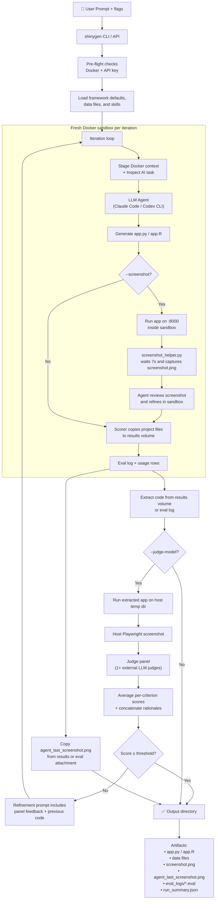

# shinygen

Generate, evaluate, and refine Shiny apps using LLM agents (Claude Code, Codex CLI) in Docker sandboxes.

## Architecture



For full documentation — installation, CLI, Python API, batch mode, GitHub Actions, model aliases, skills, and data inputs — see the published docs:

**[https://karangattu.github.io/shinygen/](https://karangattu.github.io/shinygen/)**

## Value scoring

When a judge model is enabled, shinygen now records both raw `quality_score` and value-adjusted `score` / `value_score` in `run_summary.json`. The value score deducts for extra generation iterations and generation cost, so a similarly good app that completes in one cheap attempt ranks above a costly multi-iteration run.

## OpenCode Go models

OpenCode Go's OpenAI-compatible models can be tested through Inspect's `openai-api` provider and the `mini_swe_agent` sandbox solver:

```bash
export OPENCODE_GO_API_KEY="sk-..."

shinygen generate \
    --prompt "Build a polished dashboard for this dataset" \
    --model opencode-go/kimi-k2.6 \
    --csv-file ./test_data_csv_files/airbnb-asheville-short.csv \
    --screenshot \
    --judge-model anthropic/claude-opus-4-7
```

Supported OpenCode Go aliases include `glm-5.1`, `glm-5`, `kimi-k2.5`, `kimi-k2.6`, `deepseek-v4-pro`, `deepseek-v4-flash`, `mimo-v2-pro`, `mimo-v2-omni`, `mimo-v2.5-pro`, `mimo-v2.5`, `qwen3.6-plus`, and `qwen3.5-plus`. MiniMax Go models use an Anthropic-style endpoint, so they need a future native OpenCode CLI/SDK solver or Inspect model extension to keep usage and cost measurable.

See `batch-opencode-go.json` for a ready-to-edit local benchmark template that compares frontier US models and OpenCode Go models across `skills` and `vanilla` arms.
