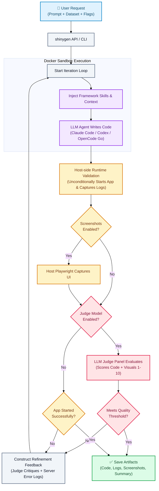

# shinygen

Generate, evaluate, and refine Shiny apps using LLM agents (Claude Code, Codex CLI) in Docker sandboxes.

## Architecture

```mermaid
%%{init: {'theme': 'base', 'themeVariables': { 'fontFamily': 'Inter, Arial, sans-serif'}}}%%
flowchart TD
    %% Color Palette Definitions
    classDef input fill:#e0f2fe,stroke:#0284c7,stroke-width:2px,color:#0c4a6e,border-radius:8px
    classDef core fill:#f1f5f9,stroke:#64748b,stroke-width:2px,color:#0f172a,border-radius:8px
    classDef agent fill:#f3e8ff,stroke:#9333ea,stroke-width:2px,color:#581c87,border-radius:8px
    classDef validation fill:#fef3c7,stroke:#d97706,stroke-width:2px,color:#78350f,border-radius:8px
    classDef judge fill:#ffe4e6,stroke:#e11d48,stroke-width:2px,color:#881337,border-radius:8px
    classDef output fill:#dcfce7,stroke:#16a34a,stroke-width:2px,color:#14532d,border-radius:8px

    A["👤 User Request<br/>(Prompt + Dataset + Flags)"]:::input --> B["shinygen API / CLI"]:::core
    
    B --> C["Start Iteration Loop"]:::core
    
    subgraph Sandbox["Docker Sandbox Execution"]
        direction TB
        C --> D["Inject Framework Skills & Context"]:::agent
        D --> E["LLM Agent Writes Code<br/>(Claude Code / Codex / OpenCode Go)"]:::agent
    end
    
    E --> F["Host-side Runtime Validation<br/>(Unconditionally Starts App & Captures Logs)"]:::validation
    
    F --> G{"Screenshots<br/>Enabled?"}:::validation
    G -- Yes --> H["Host Playwright Captures UI"]:::validation
    G -- No --> I{"Judge Model<br/>Enabled?"}:::judge
    H --> I
    
    I -- Yes --> J["LLM Judge Panel Evaluates<br/>(Scores Code + Visuals 1-10)"]:::judge
    J --> K{"Meets Quality<br/>Threshold?"}:::judge
    
    I -- No --> L{"App Started<br/>Successfully?"}:::validation
    
    K -- No --> M["Construct Refinement Feedback<br/>(Judge Critiques + Server Error Logs)"]:::core
    L -- No --> M
    M --> C
    
    K -- Yes --> N["✅ Save Artifacts<br/>(Code, Logs, Screenshots, Summary)"]:::output
    L -- Yes --> N
```

For full documentation — installation, CLI, Python API, batch mode, GitHub Actions, model aliases, skills, and data inputs — see the published docs:

**[https://karangattu.github.io/shinygen/](https://karangattu.github.io/shinygen/)**

Give your inputs in this survey to help us what kinds of dashboards we want AI to be able to generate:
**[DashSwipe Survey](https://usertestingapp.vercel.app)**
